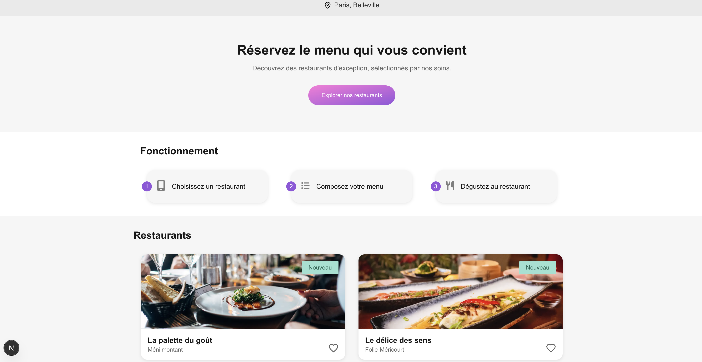

# 🍽️ Ohmyfood – Next.js

> **Projet 5 - OpenClassrooms - Parcours Développeur Front-End**



---

## 🌐 Présentation

Ohmyfood est une application web responsive qui permet aux utilisateurs de découvrir les menus de restaurants gastronomiques et de composer leur repas à l’avance.

Ce projet met l'accent sur l'intégration soignée d'une maquette Figma, l'expérience utilisateur via des **animations CSS**, et la **performance du rendu** avec **Next.js**.

🔗 **Démo en ligne :** [https://p5-ohmyfood.netlify.app](https://p5-ohmyfood.netlify.app)

---

## ⚙️ Stack technique

- ✅ **Next.js 14 (App Router)**
- ⚛️ **React 18**
- 🎨 **CSS Modules**
- 📷 **Optimisation d’images** via le dossier `public/`
- 🖋️ **Google Fonts** et **SVG personnalisés**
- 📁 Données locales (`restaurants.json`) – sans backend

---

## 🖼️ Fonctionnalités

- Page d’accueil listant les restaurants
- Navigation dynamique vers les menus
- Affichage progressif des plats (entrée / plat / dessert)
- Animations CSS :
  - Loader de chargement
  - Transitions de menus
  - Effets interactifs sur les boutons

---

## 🚀 Installation locale

> ✅ **Node.js requis :** v22.13.1 ou supérieur

### 🔧 Étapes à suivre :

```bash
# 1. Cloner le dépôt
git clone git@github.com:hNnicolas/P5_ohmyfood.git
cd P5_ohmyfood

# 2. Installer les dépendances
npm install

# 3. Lancer le serveur de développement
npm run dev
```
